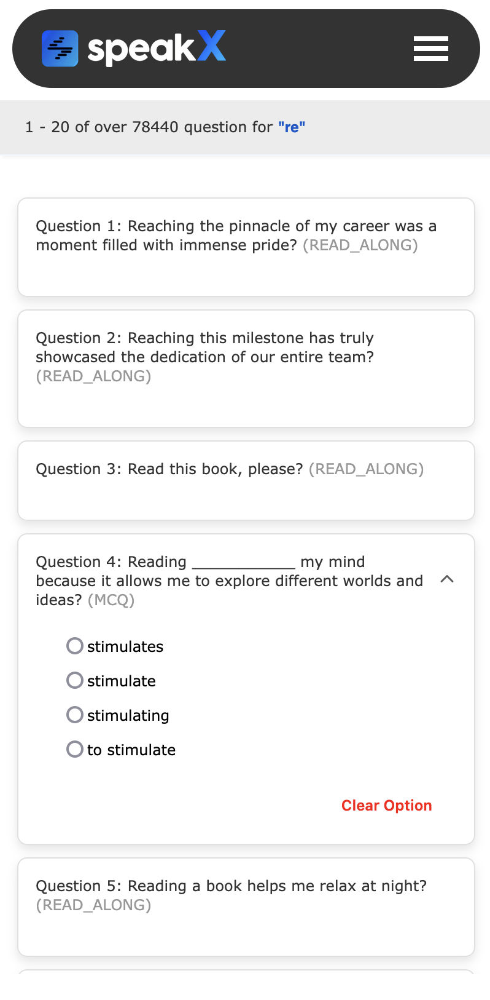

# SPEAKX - Question Search

## Home Page


---

## Pop Search Bar + History


---

## Search Suggestion


---


## Pagination + Question Page


---

## Responsive UI

<div style="display:flex; justify-content:center; align-items:center; gap:30px;">
  
  
  
  
</div>


The **SPEAKX - Question Search** application is a MERN stack project that enables users to search for questions efficiently. The application incorporates advanced search capabilities, pagination, search history, and data compression for optimized storage and retrieval. It is designed for performance, scalability, and ease of use.

---

## Features

### Frontend
1. **Home Page**:
   - Includes a search bar with a question type selector for filtering.
   - Interactive navbar for seamless navigation.

2. **Search and Results**:
   - Typing in the search bar opens a popup for additional question type selection.
   - Searches are processed via query strings, with results displayed on a dedicated question page.
   - Implements pagination for managing large sets of results efficiently.
   - Data is fetched from the backend using **Axios**.

3. **Search History and Suggestions**:
   - Tracks and displays previously searched queries using **localStorage**.
   - Only the last 10 searches are stored (using `slice(0, 10)`).
   - Provides dynamic search suggestions based on user input.


---

### Backend
1. **Database Connection**:
   - MongoDB connection handled using `connectDB.js` with asynchronous functionality.

2. **Controllers**:
   - **Question Controller**:
    - **insertAllQuestions**: Reads and decompresses question data from a gzipped file, processes the data (handling `_id` and `siblingId`), and inserts the questions into MongoDB using Mongoose's `insertMany` method.
   
    - **searchQuestion**: Fetches questions based on a search query (`title`), with pagination (`page` and `limit`). Uses MongoDB's aggregation pipeline to sort results by relevance and alphabetically, leveraging regular expressions for flexible matching.

3. **Schema**:
   - The `QuestionSchema` is defined in `QuestionSchema.js`, incorporating the following structure:
     - **AnotherQuestionSchema**: Represents blocks of questions, each containing:
       - `text`: A string representing the text of the block.
       - `showInOption`: A boolean indicating if the block should be shown as an option.
       - `isAnswer`: A boolean indicating if the block is part of the correct answer.
     - **McqQuestionSchema**: Represents multiple-choice question options, each containing:
       - `text`: A string representing the text of the option.
       - `isCorrectAnswer`: A boolean indicating if the option is the correct answer.
     - **QuestionSchema**: The main schema, which includes:
       - `_id`: A unique identifier of type `ObjectId`, required.
       - `type`: A string representing the type of the question.
       - `anagramType`: A string representing the type of anagram (if applicable).
       - `blocks`: An array of `AnotherQuestionSchema` objects, defaulting to an empty array.
       - `options`: An array of `McqQuestionSchema` objects, defaulting to an empty array.
       - `siblingId`: A reference to another question (of type `ObjectId`) for sibling relationships, defaulting to `null`.
       - `solution`: A string containing the solution or explanation for the question.
       - `title`: A string containing the title of the question.
   - This schema is tailored to handle diverse question types and complex relationships between questions.


4. **API Routing**:
      - **POST `/insertQuestions`**: Handles inserting questions into the database by reading a compressed JSON file, decompressing it, and saving the data in MongoDB.
      - **GET `/find`**: Handles searching for questions using query parameters such as `title`, `page`, and `limit`, and returns the filtered and paginated results.


5. **API Routing**:
   - Routes are structured for handling question-related endpoints.

6. **Error Handling**:
   - Comprehensive error handling implemented using `try-catch` blocks and a centralized error handler middleware.

7. **Environment Configuration**:
   - MongoDB URI and server port are managed securely using environment variables.
  
8. **API**
   - This format shows how to integrate `app.use('/api/v1/questions', QuestionRoute);` with the backend routes. Let me know if you need further assistance!


---

## Tech Stack

- **Frontend**: React.js, CSS
- **Backend**: Node.js, Express.js
- **Database**: MongoDB
- **Utilities**: zlib module for data compression
- **Deployment**: Render

---

## Getting Started

### Prerequisites

- Node.js 
- MongoDB (local)

### Installation

1. **Clone the repository**:
   ```bash
   git clone https://github.com/yourusername/SPEAKX.git
   cd SPEAKX


2. **Install backend dependencies**:

    ```bash
    cd backend
    npm install
    ```

3. **Install frontend dependencies**:

    ```bash
    cd ../frontend
    npm install
    ```

4. **Start the development servers**:
   - Backend server:
     ```bash
     cd backend
     npm start
     ```
   - Frontend server:
     ```bash
     cd frontend
     npm run dev
     ```

## Set up environment variables

Create a `.env` file in the backend directory and add the following:

- MONGO_URI=your_mongodb_connection_string
- PORT=5000

## Try the Application Online

Experience the **SPEAKX - Question Search** live in action! Explore the question search features and try out the functionality for yourself:

[**Click here to access the live application**](https://speakx-7eos.onrender.com/)  
**NOTE:** I'm experiencing performance issues with the hosted version because my `dataset` has `100,000` records. Replacing the `aggregate` function with a `find query` has slowed down the process. `But if you going with my code it not any issue.`

Feel free to explore and see how the app works in real-time!


## Deployment
This application is deployed on Render. To deploy your own version:

1. Create a new web service on Render and connect your GitHub repository.
2. Add the necessary environment variables in the Render dashboard.
3. Deploy the application.

## Acknowledgements

A big thank you to the following technologies and services that made this project possible:

- **MongoDB**: For providing a powerful and flexible NoSQL database to store and manage data.
- **Express.js**: A fast and minimalist web framework for Node.js, powering the backend of the application.
- **React**: For building the dynamic, responsive, and user-friendly frontend.
- **Node.js**: The runtime environment that makes server-side JavaScript execution possible.
- **Render**: For offering seamless cloud deployment, ensuring our app runs smoothly in production.

Special thanks to **SPEAKX** for providing this assignment, allowing me to apply and enhance my skills in full-stack development.


## Contact

If you have any questions, suggestions, or feedback, feel free to reach out:

- Open an issue on the [GitHub repository](#) for any technical queries or suggestions.
- Or contact me directly at **viahalyadav0987@gmail.com**.

I'm always happy to connect and improve the project based on your input!

